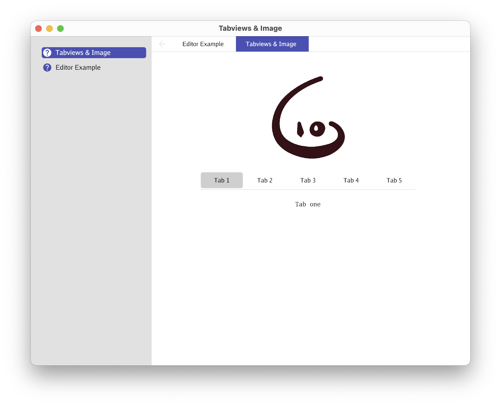
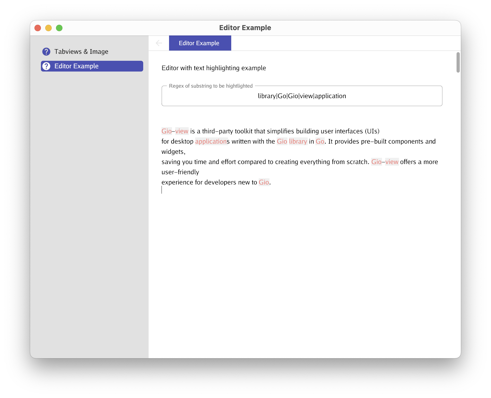

# Gio-view: A Toolkit for Faster Gio App Development

Gio-view is a third-party toolkit that simplifies building user interfaces (UIs) for desktop applications written with the Gio library in Go. It provides pre-built components and widgets, saving you time and effort compared to creating everything from scratch. Gio-view offers a more user-friendly experience for developers new to Gio.

## Features:

* **View Manager**: Manages the lifecycle of your views and handles user interactions between them.
* **Pre-built Widgets**: Includes components like editors, image viewers, lists, menus, navigation drawers, tab bars, and more.
* **Built-in Theme**: Provides a starting point for your app's visual design.
* **Custom Font Loader**: Allows you to easily integrate custom fonts into your UI.

## Benefits:

* **Faster Development**: Get started building UIs quicker with pre-built components.
* **Reduced Boilerplate**: Focus on app logic instead of writing low-level UI code.
* **Improved Developer Experience**: Provides a more user-friendly approach for building Gio applications.

## Getting Started:

For detailed information on using Gio-view, refer to the project's documentation: [godoc](https://pkg.go.dev/github.com/oligo/gioview)

## Examples:

Gio-view offers an example demonstrating its features. Clone the repository and run it from the "example" directory for a hands-on exploration.

Screenshots of the example:

 

## Caveats:

* **Desktop Focus**: Currently, Gio-view primarily targets desktop applications. While Gio itself is cross-platform, some styling adjustments might be needed for mobile UIs.
* **Limited Customization**: Out-of-the-box styles might not offer complete design flexibility.

## Contributing

Feel free to contribute by filing issues or creating pull requests to improve Gio-view.

## License

This project is licensed under the MIT License.